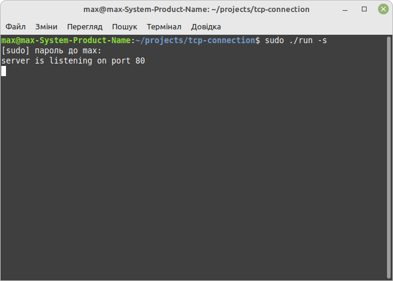
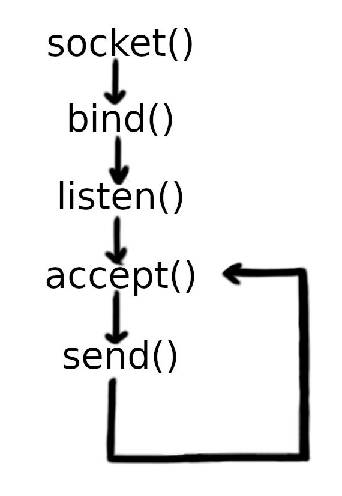
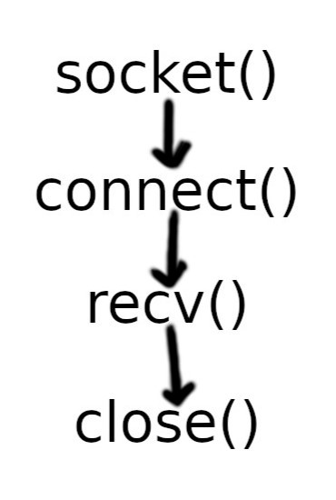

# Project Overview

## Important links

### Addressed documentation: 
- [Internet Protocol version 4 (IPv4)](https://en.wikipedia.org/wiki/IPv4)  
- [List of TCP and UDP port numbers](https://en.wikipedia.org/wiki/List_of_TCP_and_UDP_port_numbers)  
- [Main sockets header](https://pubs.opengroup.org/onlinepubs/009604599/basedefs/sys/socket.h.html)  
- [Header for Internet address family](https://pubs.opengroup.org/onlinepubs/009695399/basedefs/netinet/in.h.html)  
- [C POSIX library for other important headers](https://en.wikipedia.org/wiki/C_POSIX_library)  
- [Internet Socket Example](https://www.gnu.org/software/libc/manual/html_node/Inet-Example.html)  
- [Byte Stream Connection Server Example](https://www.gnu.org/software/libc/manual/html_node/Server-Example.html)  

## Introduction

My program is intended to show basical example of client-server message exchange using TCP protocol. For this purpose both a client and a server are implemented in a single program. The API that was used in this project is POSIX (connection-oriented) Berkeley sockets. All the resources that I accessed and used as a reference while working on this project can be found in **"Addressed documentation"** section.

The project overview contains the following chapters:  
1. Overall structure of the program.  
2. Сreation of socket and configuration of sockaddr_in structure.  
3. IP-v4 address.  
4. Server side (TCP) overview.
5. Client side (TCP) overview.

## Chapter 1: Overall structure of the program

Logically, my program can be devided in two parts:  
1. Creating a TCP socket and configuring structure for addresses of the Internet address family  
2. Initializing a server or a client based on a flag value provided by command-line arguments and using previously created and configured socket and structure for addresses.

This way I achieved using the same program both as a server and as a client (visualization in the image below).

Below are two examples of this program, but running with different command-line arguments:  
- ***first image*** is the initialization of a local server on a hard coded port 80  
- ***second image*** is the initialization of a client that receives message from that server (and then closes connection).

So, in the next chapter I will describe mine solution for the creation of socket and the configuration of structure for addresses.

## Chapter 2: Сreation of socket and configuration of sockaddr_in structure

This is the first logical part of my program and this is where IP address, port number and address family are assigned to the object of sockaddr_in structure, and then the socket is created based on the same address family, some type of connection (commonly byte-stream or datagram) and some protocol (commonly TCP or UDP).

Common values used with socket function are as follows:
1. Domain `AF_INET` is used to connect via address for IP version 4 (or IP-v4) and `AF_INET6` sets a connection via connect via address for IP version 6 (or IP-v6).
2. Type `SOCK_STREAM` is used to transmit data by TCP protocol and `SOCK_DGRAM` sets data transmission by UDP protocol.  
3. Protocol `0` is used to let the system choose a default protocol appropriate for the requested socket type, it can also be specified manually by using `IPPROTO_TCP` macros for TCP protocol and `IPPROTO_UDP` macros for UDP protocol.

For sockaddr_in structure there are less possible values:
1. `sin_family` can hold only `AF_INET` (because this structure was created to work only with IP-v4 addresses).  
2. `sin_port` holds short unsigned integer for port number (max value is 65535), transformed in network byte order (using `uint16_t htons(uint16_t hostshort);`).  
3. `sin_addr` holds an IP-v4 address in numeric binary form.

IP-v4 address for `sin_addr` can be either added using `int inet_pton(int af, const char *restrict src, void *restrict dst);` function to create it from text string (e.g. from `"127.0.0.1"`) or manually created and transformed in network byte order (using `uint32_t htonl(uint32_t hostlong);`) and then added to `s_addr` member. Another option is that `s_addr` member of `sin_addr` can be just assigned with `INADDR_ANY` macros (which means that the socket can connect or be connected to any address, equivalent to `0.0.0.0` address).

In the next chapter I will describe how I manually created numeric binary form for local address `127.0.0.1` which I used in my program.

## Chapter 3: IP-v4 address

In this project I decided to use custom IP-v4 address, which is local address `127.0.0.1`. For this purpose I manually converted four decimal numbers of one byte size each into one unsigned 32-bit integer and then used `uint32_t htonl(uint32_t hostlong);` function to change the number's byte order from host to network.

In order to explain how I've done this, I should start from reflecting on the structure of IP-v4 addresses.

So, as IP-v4 addresses consist of four bytes, the one byte itself consists of 8 bits. Example of one byte (which in this example is number one) is shown below.

So looking at possible values of 8-bit numbers we can see that the maximum value of one byte is 255. And this is exactly the maximum possible value for each number of IP-v4 addresses, as those numbers are between 0 and 255 (inclusively). 

So in total, IP-v4 addresses have size of four bytes or 32 bits (four 8-bit numbers).

And this is exactly the size of an unsigned 32-bit integer number or just `unsigned int` in C (there is also an equivalent type `uint32_t`, which is used in headers like `<netinet/in.h>`, but in practice both are just same type and they easily convert to each other). So, we could just create `unsigned int` variable to hold **the entire IP-v4 address** !

Let's see an example. Below is some random IP-v4 address represented as four decimal numbers.

Below is the same example of IP-v4 address but this time represented as one 32-bit number (in binary).

So you in the image below you can clearly see that each 8-bit segment from unsigned 32-bit integer represents one decimal number.

So we can see that each next segment of IP-v4 address starts right after the previous one. That means that the initial bit of each segment is positioned 8 bits further than the one of the previous segment. If we now compare how each segment is positioned in regard of the first one, then we see that the first segment is positioned 0 bits further than itself, the second segment is positioned 8 bits further than the first one, the third segment is positioned 16 (= 8 \* 2) bits further that the frist one and finally the fourth segment is positioned 24 (= 8 \* 3) bits further than the first one. Another fact that we should recall is that the first 8-bit number of IP-v4 address is the fourth segment of 32-bit address representation, the second number is the third segment and so on. Knowing all of that we can define the 32-bit representation of IP address as the sum of four 8-bit numbers bitwise shifted to the left accordingly to their position in the address.

We can also extract each 8-bit number of address from the 32-bit representation by using bitwise AND on the segment that we want to extract (similar to the principle of subnet masks) and then bitwise shifting the number to the right.

So, this is how I manually created 32-bit representation of IP-v4 address for `sin_addr` member using only integer values and bitwise operators.

In the next chapter I will describe my implementation of the server side of TCP connection.

## Chapter 4: Server side (TCP) overview

In this project I created the simplest implementation of server that includes following steps:  
1. Socket created in first logical part of the program binds with the server address (IP address + port number), specified by the object of sockaddr_in structure (that prevents other programs from using same port and IP, so the data won't be received by other program instead of server).  
2. Bounded socket's listen queue gets limited by a specified maximum number of connections that it will be receiving.  
3. The endless loop starts, where server will be trying to accept new connections (as long as they do not exceed the limitations for the listen queue) and when the new connection occurs, server will try to send data on that connection and then to instantly close it.

The entire sequence of `sys/socket.h` functions used for creating this implementation of TCP server is shown on the image below.

I should only mention two things:  
1. The number of connections don't need to exceed the limitations of the listen queue.  
2. The allocation of memory in loops has to be always limited (because some people forget it).

In the next chapter I will describe my implementation of the client side of TCP connection.

## Chapter 5: Client side (TCP) overview

The implementation of client is also simple in my program. It includes the following steps:
1. Client tries to connect to the server address (IP address + port number), specified by the object of sockaddr_in structure, using its socket (created in first logical part of the program).  
2. After that client tries to receive data from the server right away and then keeps receiving more data as long as server doesn't close the connection.  
- while receiving, client also prints data to the console.

The entire sequence of `sys/socket.h` functions used for creating this implementation of TCP client is shown on the image below.

## Conclusion

So in conclusion I wanted to emphasize that my goal for this project was only to show my ability to use Berkeley sockets POSIX API to create simple connection-oriented data exchange between the server and the client. This project doesn't include (and was not intended to): complex connection management, session hangling, protocol handling, logging and monitoring, timeouts, security features, error handling and other important features. Even though they should be implemented on serious business projects.