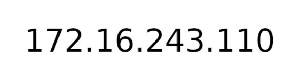
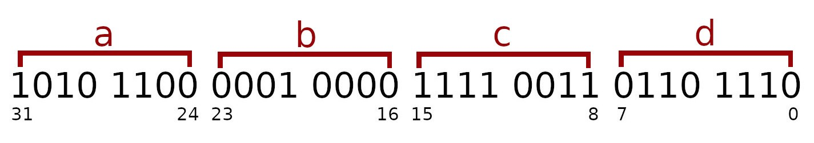

#Project Overview

##Important links

###Addressed documentation:  
- [main sockets header](https://pubs.opengroup.org/onlinepubs/009604599/basedefs/sys/socket.h.html)  
- [header for Internet address family](https://pubs.opengroup.org/onlinepubs/009695399/basedefs/netinet/in.h.html)  
- [C POSIX library for other important headers](https://en.wikipedia.org/wiki/C_POSIX_library)  
- [Internet Socket Example](https://www.gnu.org/software/libc/manual/html_node/Inet-Example.html)  
- [Byte Stream Connection Server Example](https://www.gnu.org/software/libc/manual/html_node/Server-Example.html)  

##Chapter 1: IP address

Usually, `sin_addr.s_addr` field of `sockaddr_in` structure gets assigned with `INADDR_ANY` macros. But in this project I decided to use custom IP-v4 address, which is local address `127.0.0.1`. For this purpose I manually converted four decimal numbers of one byte size each into one unsigned 32-bit integer and then used `uint32_t htonl(uint32_t hostlong);` function to change the number's byte order from host to network.

So, in order to explain how I've done this, I should mention first that one byte consists of 8 bits. Example of one byte, which is number one, is shown below.

So looking at possible values of 8-bit numbers we can see that the maximum value of one byte is 255. And this is perfectly suitable for IP-v4 addresses, because each segment of this address consists (exactly!) of numbers between 0 and 255 (inclusively). 

So in total, IP-v4 addresses have size of four bytes or 32 bits (four 8-bit numbers).

And this is exactly the size of an unsigned 32-bit integer number or just `unsigned int` in C (there is also an equivalent type `uint32_t`, which is used in headers like `<netinet/in.h>`, but in practice both are just same type and they easily convert to each other). So, we could just create `unsigned int` variable to hold **the entire IP-v4 address** !

Let's see an example. Below is some random IP-v4 address represented as four decimal numbers.

Below is the same example of IP-v4 address but this time represented as one 32-bit number (in binary).

So you in the image below you can clearly see that each 8-bit segment from unsigned 32-bit integer represents one decimal number.

So we can see that each next segment of IP-v4 address starts right after the previous one. That means that the initial bit of each segment is positioned 8 bits further than the one of the previous segment. If we now compare how each segment is positioned in regard of the first one, then we see that the first segment is positioned 0 bits further than itself, the second segment is positioned 8 bits further than the first one, the third segment is positioned 16 (= 8 \* 2) bits further that the frist one and finally the fourth segment is positioned 24 (= 8 \* 3) bits further than the first one. Another fact that we should recall is that the first 8-bit number of IP-v4 address is the fourth segment of 32-bit address representation, the second number is the third segment and so on. Knowing all of that we can define the 32-bit representation of IP address as the sum of four 8-bit numbers bitwise shifted to the left accordingly to their position in address.

We can also extract each 8-bit number of address from the 32-bit representation by using bitwise AND on the segment that we want to extract (similar to the principle of subnet masks) and then bitwise shifting the number to the right.

